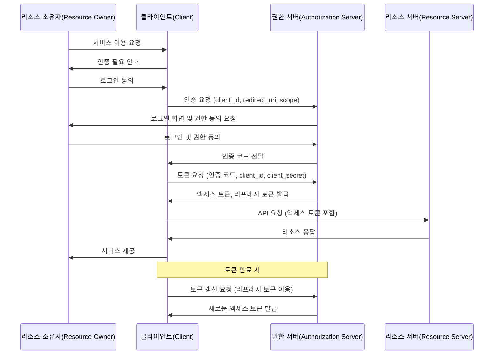

- OAuth(Open Authorization) 사용자가 비밀번호를 공유하지 않고도 타사 어플리케이션이 사용자의 리소스에 접근할 수 있도록 허용하는 인증 및 권한 부여를 위한 개방형 표준 프로토콜
- 주로 소셜 로그인(예: 네이버, 구글, 카카오)과 같은 사용자 인증에 사용됨
- OAuth와 OAuth2의 차이점
	- OAuth는 초기 보전으로 복잡하고 확장성이 부족했음
	- OAuth2는 단순화된 구조와 다양한 인증 방식을 제공하며 현재 널리 사용됨

- 동작 구성

---

## 주요 개념 및 역할
### 리소스 서버(Resource Server)
- 보호된 리소스를 제공하는 서버
- 액세스 토큰을 통해 요청을 확인하고 데이터를 반환함
### 리소스 소유자(Resource Owner)
- 클라이언트가 리소스에 접근하도록 권한을 부여
- 보호된 리소스(예: 사용자 데이터)의 소유자. 일반적으로 최종 사용자(end-user)를 의미
- 예: 네이버 로그인에서 사용자가 자신의 네이버 계정을 통해 다른 어플리케이션에 접근 권한을 부여하는 경우, 이 사용자가 리소스 소유자가 됨
### 클라이언트(Client)
- 리소스 소유자를 대신해 리소스 서버에 접근하는 어플리케이션
- 예: 웹 어플리케이션, 모바일 앱 등
### 권한 서버(Authorization Server)
- 사용자 인증을 수행하고 액세스 토큰을 발급하는 서버

---

## 인증 과정
### 1. 클라이언트 등록
- 클라이언트는 권한 서버에 등록되어 클라이언트 ID와 클라이언트 시크릿을 발급받음
- 클라이언트는 redirect URI도 등록하여 인증 후 사용자가 돌아올 위치를 지정함
- 클라이언트는 필요한 권한 범위(scope)도 미리 정의함
### 2. 사용자 인증 및 권한 부여
- 사용자가 클라이언트를 통해 로그인 요청을 보냄
- 권한 서버는 로그인 페이지를 제공하고 사용자가 ID와 비밀번호를 입력함
- 권한 서버는 사용자에게 클라이언트가 요청한 권한 범위(scope)를 명확히 보여주고 동의를 구함
- 사용자가 클라이언트의 요청에 동의하면 인증코드(Authrization Code)를 발급함
### 3. 액세스 토큰 발급
- 클라이언트는 인증코드를 권한 서버에 전달하고, 이를 통해 액세스 토큰을 발급받음
- 이 과정에서 클라이언트 ID와 클라이언트 시크릿이 필요
- 권한 서버는 일반적으로 액세스 토큰과 함께 리프레시 토큰도 발급함
- 액세스 토큰에는 만료 시간이 설정되어 있음
### 4. 리소스 요청
- 클라이언트는 액세스 토큰을 사용하여 리소스 서버에 데이터를 요청함
- 리소스 서버는 액세스 토큰의 유효성을 검증하고 데이터를 반환함
### 5. 리프레시 토큰 사용
- 액세스 토큰이 만료되면 클라이언트는 리프레시 토큰을 사용하여 사용자 개입 없이 새로운 액세스 토큰을 발급받을 수 있음

---

## 인증 방식(Grant Type)
### Authrization Code Grant
- 가장 일반적인 방식으로 보안성이 높음
- 주로 웹 어플리케이션에서 사용됨
### Authorization Code Grant with PKCE
- 모바일 앱이나 SPA(Single Page Application)에서 사용되는 보안 강화 버전의 인증 코드 방식
- PKCE(Proof Key for Code Exchange)를 사용하여 인증 코드 가로채기 공격을 방지함
### Implicit Grant
- 브라우저 기반 어플리케이션에서 사용되며, 보안 취약점으로 인해 현재는 권장되지 않음
- Authorization Code Grant with PKCE 사용을 권장함
### Resource Owner Password Credentials Grant
- 사용자가 직접 ID/PW를 입력하여 액세스 토큰을 받음
- 신뢰할 수 있는 어플리케이션에서만 사용해야함
### Client Credentials Grant
- 클라이언트가 자체적으로 액세스 토큰을 요청하는 방식으로 Machine-To-Machine(M2M) 인증에 적합함
### Device Authrization Grant
- 스마트 TV나 IoT 장치와 같이 입력이 제한된 기기에서 사용되는 방식
### Refresh Token Grant
- 기존 액세스 토큰이 만료되었을 때 새로운 액세스 토큰을 발급받는 방식