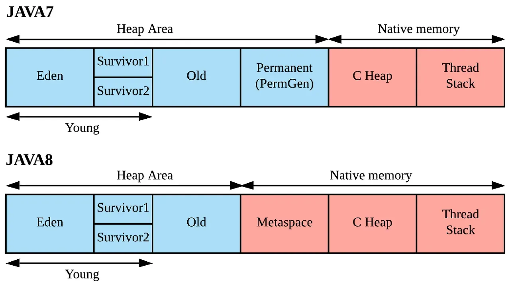

- Java 8 부터 도입된 메모리 영역
- 이전 버전에서 사용되던 PermGen(Permanent Generation) 영역을 대체함
- Java 의 Classloader 가 로드한 class 들의 metadata 가 저장되는 공간임

## 도입 사유

- PermGen 영역은 다음과 같은 문제가 있었음
  
  - 메모리 관리의 복잡성
    
      크기 조정이 어려워 클래스 로딩이 많은 앱에서 메모리 부족 현상이 발생함
  
  - 메모리 누수
    
      동적 클래스 생성이 빈번한 경우 메모리 누수의 발생할 수 있었음

- 위 문제를 해결하기 위해 Metaspace 가 도입됨

- 더 나은 메모리 관리와 성능 향상을 제공함

## PermGen 과 Metaspace 의 차이 표

| 구분       | PermGen                      | Metaspace                       |
| -------- | ---------------------------- | ------------------------------- |
| 메모리 위치   | Heap Area                    | Native Memory                   |
| 기본 크기 제한 | x86(32): 64MB <br> x64: 82MB | 기본사이즈는 하드웨어 스펙마다 다름             |
| 자동 확장 지원 | X                            | O <br> 시스템 가용 메모리 한도까지 확장될 수 있음 |

## Metaspace 와 GC 의 관계

- Metaspace 의 메모리 감시 주기는 Major GC, Full GC 의 주기와 연관되어 있음
- Minor GC (Young GC) 에는 영향을 받지 않음
1. Minor GC (Young GC)
   - Heap Memory 에서 객체를 관리하는데 사용
     Eden 영역에서 객체가 할당되고
     살아남은 객체는 Survivor 영역으로 이동한뒤 Old 영역으로 이동함
   - Young 영역의 사용률이 높아져서 더 이상 새로운 객체를 할당할 수 없을때 발생
   - Metaspace 와의 관계
     - Metaspace 는 Heap 영역이 아닌 Native Memory 에서 존재함
     - Minor GC 는 Heap 의 Young 영역만 대상으로 하므로 
       Metapspace 에 직접적인 영향을 끼치지 않음
2. Major GC (Old GC)
   - Heap Memory 에서 Old 영역의 메모리 해제를 담당
   - Old 영역의 사용률이 높아져서 더 이상 객체를 수용할 수 없을때 발생
   - Metaspace 와의 관계
     - Metaspace 자체는 Major GC 의 대상은 아님
     - 하지만 Major GC 가 발생할 때 클래스 언로딩 (class unloading) 이 발생할 수 있음
     - 이때, JVM 은 더 이상 참조 되지 않는 클래스와 관련된 메타데이터를 Metaspace 에서 해제함
     - 즉 Metaspace 의 Memory 회수는 Major GC 와 함께 일어날 수 있음
3. Full GC
   - JVM 의 전체 Memory  영역을 대상으로 수행되는 GC
   - Old 영역의 사용률이 임계치를 초과하거나 메모리 부족 상태가 발생할 때 발생
   - Metaspace 와의 관계
     - Full GC 발생시, 더 이상 사용되지 않는 클래스와 클래스 로더가 언로드되면서 
       <br>이와 관련된 메타데이터가 Metaspace 에서 회수됨

## 설정 방법

- 초기 크기 설정
  
    이 값을 넘어가면 Full GC 가 발생
  
  ```
  # -XX:MetaspaceSize=<크기>
  -XX:MetaspaceSize=1024
  ```

- 최대 크기 설정
  
    이 값을 설정하지 않으면 시스템 가용 메모리 한도까지 늘어날 수 있음
  
  ```
  # -XX:MaxMetaspaceSize=<크기>
  -XX:MaxMetaspaceSize=10G
  ```

- 여유 공간 비율 설정
  
  - 최소 여유 공간 비율
    
      기본값 40
    
      가용 영역의 최소 백분율
    
      Metaspace 가 차서 Full GC 가 일어나기 전에 Metaspace 영역을 늘림
    
      늘려주는 사이즈는 JVM 이 알아서 정함
    
    ```
    -XX:MinMetaspaceFreeRatio=<정수>
    ```
  
  - 최대 여유 공간 비율
    
      기본값 70
    
      Metaspace 의 여유 공간이 많을 경우 영역을 줄임
    
    ```
    -XX:MaxMetaspaceFreeRatio=<정수>
    ```

---

### 궁금한점

- Spring Framework와 JPA를 사용하는 환경에서 클라이언트 요청이 많아져 JPA와 같은 이벤트가 많이 발생한다고 가정합시다. 일반적으로 클라이언트의 요청은 짧은 시간 동안 처리되므로 대부분의 경우 Minor GC에서 처리가 끝날 것 같습니다. 그런데, Minor GC는 Metaspace 영역을 정리하지 않기 때문에, Spring이나 JPA에서 리플렉션을 이용해 동적으로 생성된 클래스는 Metaspace에서 해제되지 않을 것이라 생각됩니다. 그렇다면 클라이언트 요청이 많아질수록 Metaspace 영역이 빠르게 증가할 것 같은데, 이로 인해 Full GC가 그만큼 자주 발생하게 되는 건가요?
  
    → 이건 reflection 이나 proxy 클래스를 재사용 설명 글에 따로 작성할것임